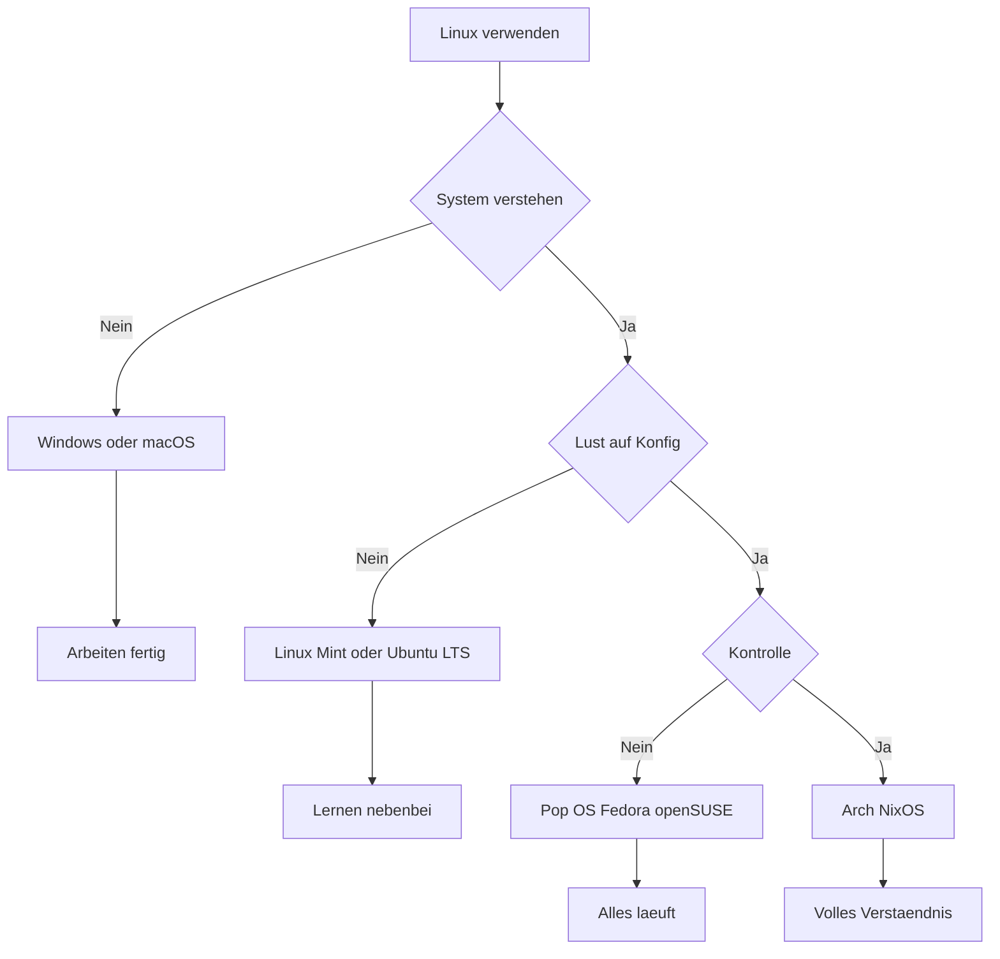
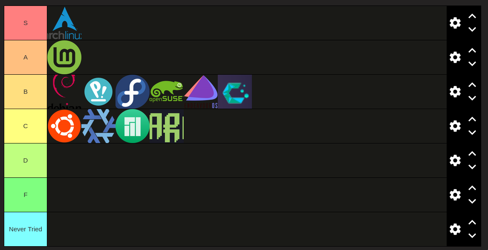

# Welche Linux Distro für 2026

#iusearchbtw :)

# Tierlist

## Debian basiert

### Debian

* 🌐 [https://www.debian.org](https://www.debian.org)
* ✅ Vorteil Extrem stabil und sehr gut getestet
* ❌ Nachteil Pakete oft nicht aktuell

### Linux Mint

* 🌐 [https://linuxmint.com](https://linuxmint.com)
* ✅ Vorteil Sehr einsteigerfreundlich und sofort nutzbar
* ❌ Nachteil Weniger flexibel bei sehr neuer Hardware

### Pop OS

* 🌐 [https://system76.com/pop](https://system76.com/pop)
* ✅ Vorteil Sehr gute Hardware Unterstützung und Entwickler Fokus
* ❌ Nachteil Stark auf GNOME und eigene Lösungen fixiert

### Ubuntu LTS

* 🌐 [https://ubuntu.com](https://ubuntu.com)
* ✅ Vorteil Große Community und lange Sicherheitsupdates
* ❌ Nachteil Canonical Entscheidungen nicht immer beliebt

## Arch basiert

### Arch Linux

* 🌐 [https://archlinux.org](https://archlinux.org)
* ✅ Vorteil Maximale Kontrolle und immer aktuelle Software
* ❌ Nachteil Viel Konfiguration und steile Lernkurve

### Manjaro

* 🌐 [https://manjaro.org](https://manjaro.org)
* ✅ Vorteil Arch Gefühl mit einfacher Installation
* ❌ Nachteil Verzögerte Updates

### EndeavourOS

* 🌐 [https://endeavouros.com](https://endeavouros.com)
* ✅ Vorteil Sehr nah an Arch und trotzdem einsteigerfreundlich
* ❌ Nachteil Weniger grafische Tools

### CachyOS

* 🌐 [https://cachyos.org](https://cachyos.org)
* ✅ Vorteil Stark auf Performance optimiert
* ❌ Nachteil Sehr speziell und nicht für jeden sinnvoll

### Omarchy

* 🌐 [https://omarchy.org](https://omarchy.org)
* ✅ Vorteil Fokus auf moderne Desktop Setups
* ❌ Nachteil Kleine Community und wenig Langzeiterfahrung

## Red Hat basiert

### Fedora

* 🌐 [https://fedoraproject.org](https://fedoraproject.org)
* ✅ Vorteil Sehr aktuell und technisch sauber
* ❌ Nachteil Kurze Release Lebensdauer

## SUSE basiert

### openSUSE Leap

* 🌐 [https://www.opensuse.org](https://www.opensuse.org)
* ✅ Vorteil Enterprise Stabilität und lange Wartung
* ❌ Nachteil Software oft älter

### openSUSE Tumbleweed

* 🌐 [https://www.opensuse.org](https://www.opensuse.org)
* ✅ Vorteil Rolling Release mit sehr hoher Qualität
* ❌ Nachteil Sehr häufige Updates

## Andere

### NixOS

* 🌐 [https://nixos.org](https://nixos.org)
* ✅ Vorteil Reproduzierbare und saubere Systeme
* ❌ Nachteil Ungewöhnliches Konzept und steile Lernkurve

