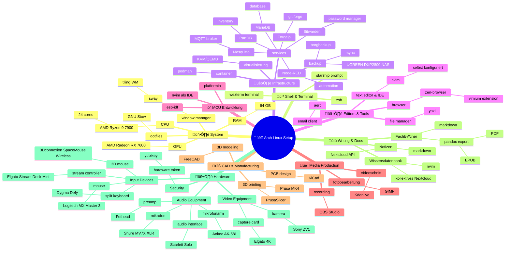

# üêß my-arch-setup

> *I use Arch btw*

```mermaid
mindmap
  root((üêß Arch Linux Setup))
    🖥️ System
      window manager
        sway
          tiling WM
      dotfiles
        GNU Stow
      CPU
        AMD Ryzen 9 7900
          24 cores
      GPU
        AMD Radeon RX 7600
      RAM
        64 GB
    💻 Shell & Terminal
      zsh
      starship prompt
      wezterm terminal
    🏗️ Infrastructure
      backup
        rsync
        borgbackup
        UGREEN DXP2800 NAS
      container
        podman
      virtualisierung
        KVM/QEMU
      services
        Bitwarden
          password manager
        Node-RED
          automation
        Mosquitto
          MQTT broker
        MariaDB
          database
        Forgejo
          git forge
        PartDB
          inventory
    🛠️ Editors & Tools
      text editor & IDE
        nvim
          selbst konfiguriert
      file manager
        yazi
      email client
        aerc
      browser
        zen-browser
          vimium extension
    ‚ö° MCU Entwicklung
      esp-idf
      platformio
      nvim als IDE
    🎬 Media Production
      recording
        OBS Studio
      fotobearbeitung
        GIMP
      videoschnitt
        Kdenlive
    üîß CAD & Manufacturing
      3D modeling
        FreeCAD
      3D printing
        PrusaSlicer
        Prusa MK4
      PCB design
        KiCad
    üìù Writing & Docs
      Fachbücher
        markdown
        pandoc export
          PDF
          EPUB
      Notizen
        markdown
        Nextcloud API
      Wissensdatenbank
        nvim
        kollektives Nextcloud
    🖱️ Hardware
      Input Devices
        split keyboard
          Dygma Defy
        mouse
          Logitech MX Master 3
        3D mouse
          3Dconnexion SpaceMouse Wireless
        stream controller
          Elgato Stream Deck Mini
      Audio Equipment
        mikrofon
          Shure MV7X XLR
        mikrofonarm
          Aokeo AK-58i
        preamp
          Fethead
        audio interface
          Scarlett Solo
      Video Equipment
        kamera
          Sony ZV1
        capture card
          Elgato 4K
      Security
        hardware token
          yubikey
```
